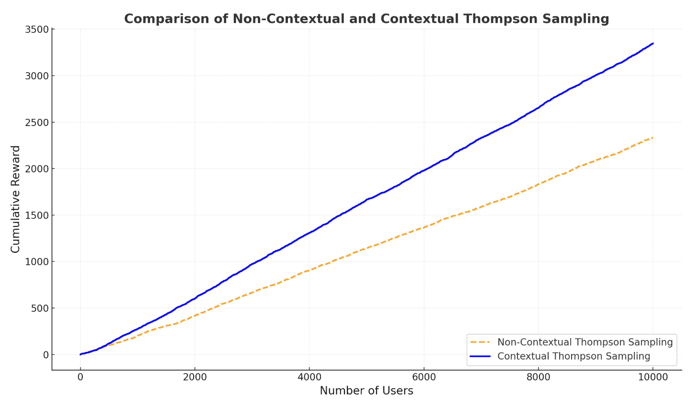

Contextual bandits are a type of machine learning problem that sits between multi-armed bandits and reinforcement learning. They are used in online decision-making scenarios, like recommending products. Why are they cool?

## Multi-Armed Bandits (MAB)

Imagine you have three products (A, B, and C) to suggest to users, but you don't know which one they prefer. You need to balance: 
* **Exploration**: showing different products to learn user preferences
* and **Exploitation**: recommending the product that seems to perform best so far. 

*For example, if Product A gets the most clicks from users after some trials, you’ll show it more often, but occasionally test B and C to ensure you're not missing out on a better option.*

In a multi-armed bandit problem, you don't have any extra information (or context) about the arms—just the reward signals.

##  Contextual Bandits
Now imagine you're still recommending products, but you receive some context or information. For example:

A user visits your website, and you know their age, location, and past behavior.
Before showing them a product, you know the time of day and the device they're using.

In a contextual bandit problem, you use the experience to improve future decisions in similar contexts (for example, if younger users tend to click on Product A and older users on Product B, the system learns to recommend products based on the user's profile).


##  What's the difference between Full Reinforcement Learning (RL) and Contextual Bandits?

Contextual Bandits: Only the immediate reward matters. There’s no consideration of long-term consequences.
Full RL: Actions affect future states and rewards, and there's a long-term strategy involved.

## Action!
Let's see a comparison between regular and contextual TS in action!

```
import numpy as np
import matplotlib.pyplot as plt
from scipy.stats import beta

# Simulation Parameters
N_PRODUCTS = 5
N_USERS = 10000
AGE_GROUPS = [20, 30, 40, 50]  # User age groups

# Below we are defining the ground truth, that we will later compare against in simulation outcomes
# True conversion rates for products in each age group
true_conversion_rates = {
    20: [0.1, 0.3, 0.2, 0.05, 0.1],
    30: [0.2, 0.1, 0.4, 0.15, 0.05],
    40: [0.05, 0.2, 0.1, 0.4, 0.25],
    50: [0.1, 0.15, 0.3, 0.25, 0.2],
}

# Generate users with random ages
np.random.seed(42)
user_ages = np.random.choice(AGE_GROUPS, size=N_USERS)

# Function to simulate user interaction and generate rewards
def get_reward(age, product):
    return np.random.rand() < true_conversion_rates[age][product]

def thompson_sampling_non_contextual(n_users):
    rewards = []
    alpha = np.ones(N_PRODUCTS)
    beta_params = np.ones(N_PRODUCTS)
    
    for _ in range(n_users):
        sampled_theta = np.random.beta(alpha, beta_params)
        selected_product = np.argmax(sampled_theta)
        reward = get_reward(np.random.choice(AGE_GROUPS), selected_product)
        rewards.append(reward)
        if reward:
            alpha[selected_product] += 1
        else:
            beta_params[selected_product] += 1

    return np.cumsum(rewards)
```

Introducing contextual sampling basically means introducing extra parameters that would help evaluate the right alpha and beta, while the rest of the logic remains the same.

```
def thompson_sampling_contextual(n_users, user_ages):
    rewards = []
    alpha = {age: np.ones(N_PRODUCTS) for age in AGE_GROUPS}
    beta_params = {age: np.ones(N_PRODUCTS) for age in AGE_GROUPS}
    
    for user_idx in range(n_users):
        user_age = user_ages[user_idx]
        sampled_theta = np.random.beta(alpha[user_age], beta_params[user_age])
        selected_product = np.argmax(sampled_theta)
        reward = get_reward(user_age, selected_product)
        rewards.append(reward)
        if reward:
            alpha[user_age][selected_product] += 1
        else:
            beta_params[user_age][selected_product] += 1

    return np.cumsum(rewards)
```

Simulate and Compare
```
non_contextual_rewards = thompson_sampling_non_contextual(N_USERS)
contextual_rewards = thompson_sampling_contextual(N_USERS, user_ages)
```

And this illustrates how much you can gain in rewards:


